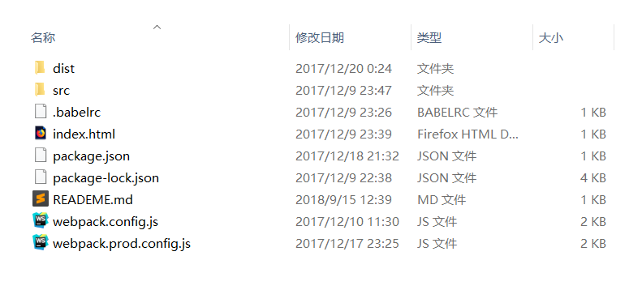

## 技术栈
前端：H5+CSS3+React+Antd+skPlayer
后台数据来源：[NeteaseCloudMusicApi](https://github.com/Binaryify/NeteaseCloudMusicApi)
## 项目时间
2017.12.9至12.20

## 总结
刚学习react.js时候写的项目，刚好是大一下学期期末作业23333.试水练习了一下，居然超like这个框架